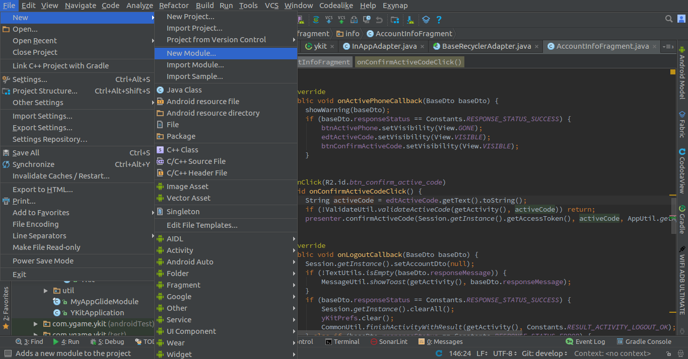

# YKit for Android

## 1 - Add library: xlauncher.aar

+ Click **File > New > New Module**.


+ Click **Import .JAR/.AAR Package** then click **Next**.


+ Enter the location of **ykit-release.aar"** file then click **Finish**. 
  
## 2 - Add Config App

+ Add some libraries in build.gradle in your app.  
```
    compile 'com.google.android.gms:play-services-analytics:9.0.0'
    compile 'com.google.android.gms:play-services-auth:9.0.0'
    compile 'com.facebook.android:facebook-android-sdk:4.+'
    compile 'com.google.code.gson:gson:2.7'    
    compile 'com.github.bumptech.glide:glide:3.7.0'    
    compile 'org.greenrobot:eventbus:3.0.0'    
    compile 'com.appsflyer:af-android-sdk:4+@aar'
``` 

  `

+ Open File: AndroidManifest.xml 
 Add some user permissions 
      
 ```
    <users-permission android:name="android.permission.INTERNET" />
    <users-permission android:name="android.permission.SYSTEM_ALERT_WINDOW" />
    <users-permission android:name="android.permission.TYPE_SYSTEM_OVERLAY" />

 ```
 
 Add Config for facebook and Services Xlauncher in Application tag
 
 ```
        <meta-data android:name="com.facebook.sdk.ApplicationId" android:value="@string/fb_id"/>
        <activity android:name="com.facebook.FacebookActivity" tools:replace="android:theme" android:configChanges="keyboard|keyboardHidden|screenLayout|screenSize|orientation" android:label="@string/app_name" android:theme="@android:style/Theme.Translucent.NoTitleBar"/>
        <provider
            android:authorities="com.facebook.app.FacebookContentProviderXXXXXXXXXX"
            android:name="com.facebook.FacebookContentProvider" android:exported="true"/>
 ```
  
 Please replace the "XXXXXXXXXX" string in "com.facebook.app.FacebookContentProviderXXXXXXXXXX" with your facebook id. You can get the Facebook ID in file XLauncherConfig.txt
           
      
   
 + Define value fb_id in strings.xml  (Get Facebook ID in file: XLauncherConfig.txt)
 
 
   
 + Add two file : XluancherConfig.txt and google-services.json to project (create the assets directory if it's not exist)
 
  
 
## 3 - Implement code

  + In your main activity class, init the Xlauncher by adding some codes on the onCreate function. 
  
  ```
  @Override
    protected void onCreate(Bundle savedInstanceState) {
        super.onCreate(savedInstanceState);
        setContentView(R.layout.activity_main);

        //init the xlauncher
        Xlauncher.setContext(this);
        
        //init the enviroment
        Xlauncher.setDomainDebug(false);    //if you want to build in TEST MODE, pass it to TRUE
        
        Xlauncher.checkPermissionDragIcon(this);
        
        //handle event listener
        Xlauncher.setOnListenEvent(new Xlauncher.OnListenEvent() {
            @Override
            public void onLoginSuccess(int idUser, String token) {
                //login success
            }

            @Override
            public void onLogOutSuccess() {
                //logout success
            }

            @Override
            public void onLoginAutoSuccess(int idUser, String token) {
                //auto login success
            }

            @Override
            public void onPaymentSuccess(int typePay, String extraData) {
                //on payment success
            }

            @Override
            public void onPauseXluancher() {
                //call when Xlauncher close
            }

            @Override
            public void onResumeXluancher() {
                //call when Xlauncher open
            }
        });
    }
  ```
  
  - In the previous code, we provide some callback functions. 
  + onLoginSuccess, onLoginAutoSuccess: notify when user login to Xlauncher system successfully. Handle this function and call login with your server
  + onLogoutSuccess: the event will be fired when user sign out of Xlauncher system. In this case, you must kick the user out of your server as well.
  + onPaymentSuccess: notify the payment success
  + onPauseXluancher: call when Xlauncher close
  + onResumeXluancher: call when Xlauncher open
  
  *** IMPORTANT ***
  Please keep in your mind the line "Xlauncher.setDomainDebug(false)".  
[Read here for more detail about how to setup the TEST enviroment](https://github.com/xctcorporation/ServerIntegration/blob/master/SetupTheEnviroment.md)
  
  - Add some codes on the onDestroy, onPause, onResume, onActivityResult function
  
  ```
    @Override
    protected void onDestroy() {
        super.onDestroy();

        Xlauncher.onDestroy();
    }

    @Override
    protected void onResume() {
        super.onResume();

        Xlauncher.onResume(this);
    }

    @Override
    protected void onPause() {
        Xlauncher.onPause(this);

        super.onPause();
    }

    @Override
    protected void onActivityResult(int requestCode, int resultCode, Intent data) {
        Xlauncher.onActivityResult(requestCode, resultCode, data, this);
    }
  ```
  
  + If you want to check auto login, use this code
  
  ```
        //use auto login
        if(!Xlauncher.autoLogin()){
            Xlauncher.openLoginScreen(this);
        }
  ```
  
## 4 - Payment integration
  
  + Create File GamePaymentExtraData with method return "ID Game of User" 
  
    Payment extra data (PED) is the data you send to game server when user make payment success. For example: if your game    have multiple servers or multiple characters, you may want to send this data to game server, so its will know which character get the gold. The format is defined on your demand.

   Note*: 
   - PED must be unique string 
   - The maximum length of PED is 50 characters 
   - There's no special character in PED
  
  + Open screen Payment : 
  
  ```
        //set PED to xlauncher. Remember set PED before open payment screen.
        String PED = xxxxxxxxxxxx;
        Xlauncher.setValueGameOrder(PED);
        
        //open payment screen
        Xlauncher.openPaymentScreen(this);
  ```
  
[Read here for more detail about how to use the PED in payment process](https://github.com/xctcorporation/ServerIntegration/blob/master/PaymentNote.md)
 
## 5 - Video Guide

[](http://www.youtube.com/watch?v=n7R_ZLYWV_A "How to integrate xlauncher to android")