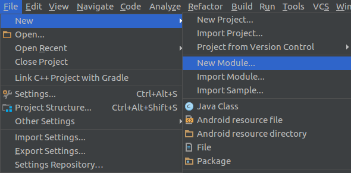
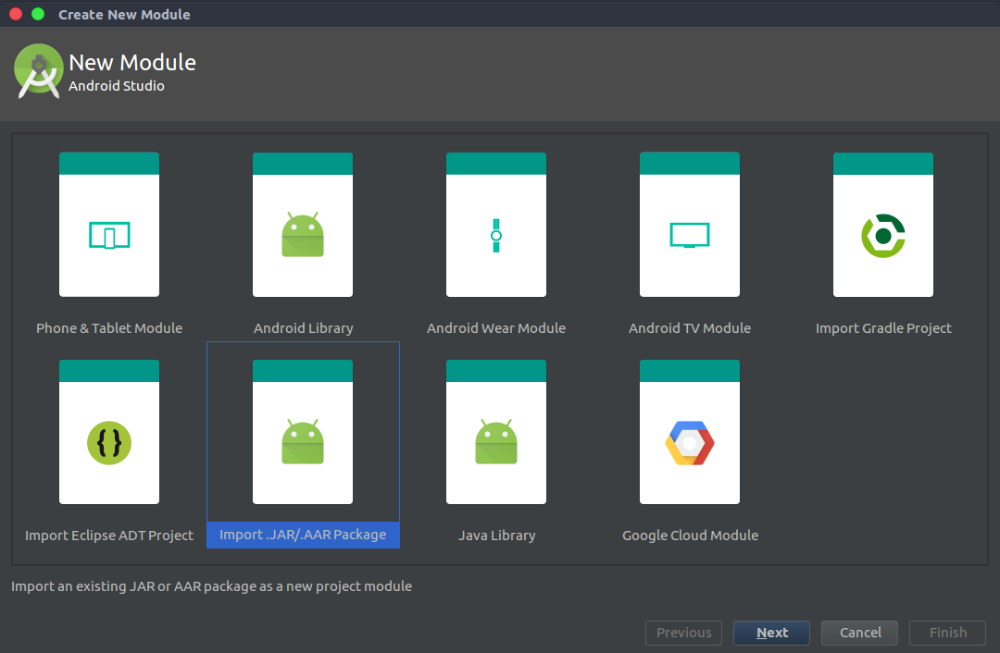
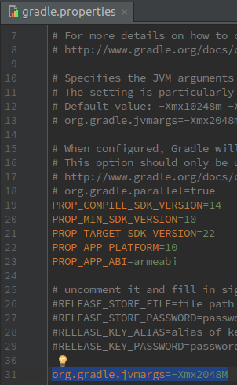
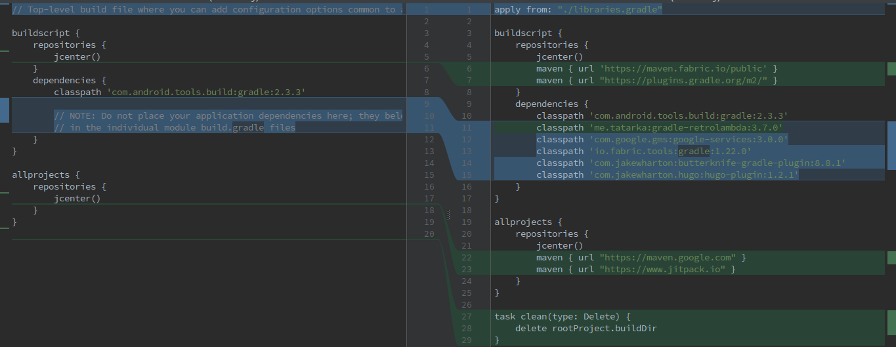
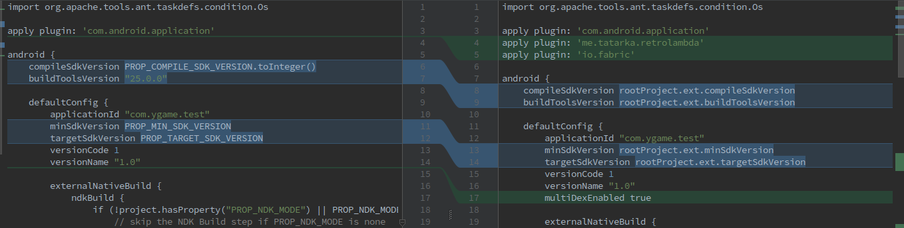
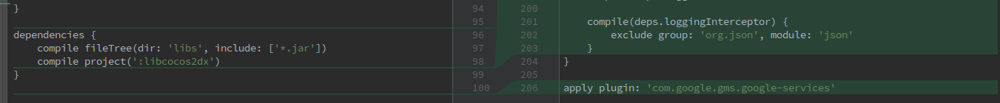
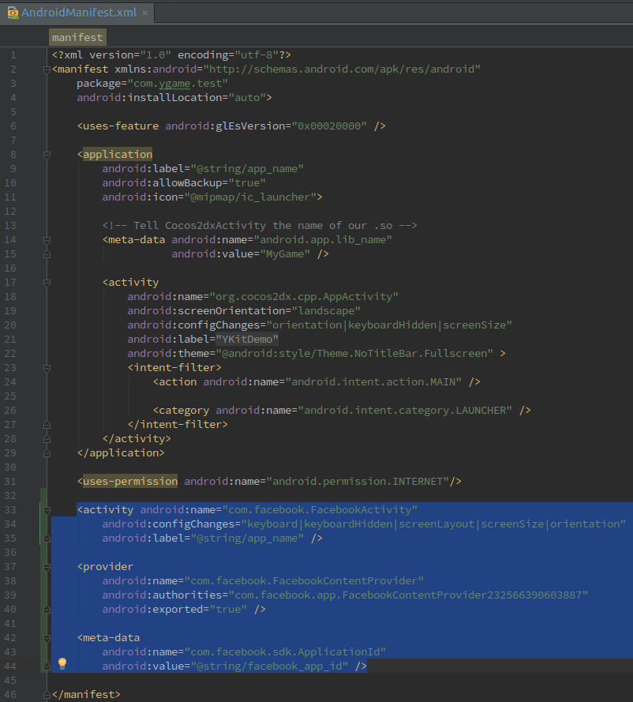
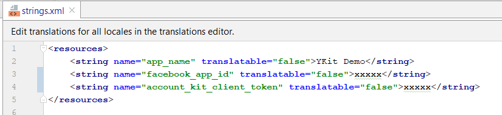
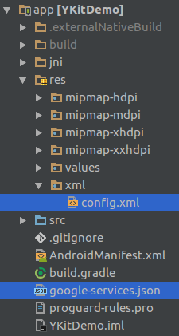

# YKit for Android

You can get config files in [files folder](files/) 

## 1 - Add YKit library

+ Click **File > New > New Module**

    

+ Click **Import .JAR/.AAR Package** then click **Next**

    

+ Enter the location of **ykit-release.aar** file then click **Finish**

    

+ Add `libraries.gradle` to root project folder

    

+ Add this line end of file `settings.gradle`

    ```
    org.gradle.jvmargs=-Xmx2048m
    ```

    

+ Update top-level `build.gradle` (`YKitDemo/proj.android-studio/build.gradle`)

```
    apply from: "./libraries.gradle"
    
    buildscript {
        repositories {
            jcenter()
            maven { url 'https://maven.fabric.io/public' }
            maven { url "https://plugins.gradle.org/m2/" }
        }
        dependencies {
            classpath 'com.android.tools.build:gradle:2.3.3'
            classpath 'me.tatarka:gradle-retrolambda:3.7.0'
            classpath 'com.google.gms:google-services:3.0.0'
            classpath 'io.fabric.tools:gradle:1.22.0'
            classpath 'com.jakewharton:butterknife-gradle-plugin:8.8.1'
            classpath 'com.jakewharton.hugo:hugo-plugin:1.2.1'
        }
    }
    
    allprojects {
        repositories {
            jcenter()
            maven { url "https://maven.google.com" }
            maven { url "https://www.jitpack.io" }
        }
    }
    
    task clean(type: Delete) {
        delete rootProject.buildDir
    }
```



+ Update module-level`build.gradle` (`YKitDemo/proj.android-studio/app/build.gradle`)

    ```
    apply plugin: 'me.tatarka.retrolambda'
    apply plugin: 'io.fabric'
    
    android {
        compileSdkVersion rootProject.ext.compileSdkVersion
        buildToolsVersion rootProject.ext.buildToolsVersion
        
        defaultConfig {
            [...]
            minSdkVersion rootProject.ext.minSdkVersion
            targetSdkVersion rootProject.ext.targetSdkVersion
            multiDexEnabled true
        }
        
        compileOptions {
            sourceCompatibility rootProject.ext.sourceCompatibilityVersion
            targetCompatibility rootProject.ext.targetCompatibilityVersion
        }
        
        dexOptions {
            maxProcessCount 8
        }
    }
    
    dependencies {
        [...]
        compile project(':ykit-release')
        
        compile deps.supportDesign
        compile deps.appcompatv7
        compile deps.recyclerviewv7
    
        compile deps.multidex
    
        compile deps.firebaseCore
        compile deps.firebaseMessaging
        compile deps.firebaseConfig
    
        compile deps.playServicesAuth
    
        compile deps.billing
    
        compile(deps.crashlytics) { transitive = true; }
        compile(deps.answers) { transitive = true; }
    
        compile deps.butterknife
        annotationProcessor deps.butterknifeCompiler
    
        compile deps.dagger
        annotationProcessor deps.daggerCompiler
    
        compile deps.androidannotations
        annotationProcessor deps.androidannotationsCompiler
    
        compile deps.parceler
        annotationProcessor deps.parcelerCompiler
    
        compile deps.retrofit
        compile deps.retrofitConverterGson
        compile deps.retrofitAdapterRxjava
    
        compile deps.okhttp
        compile deps.okhttpInterceptor
    
        compile deps.gson
    
        compile deps.transitionseverywhere
        compile deps.calligraphy
    
        compile deps.glide
        annotationProcessor deps.glideCompiler
    
        compile deps.rxjava
        compile deps.rxandroid
        compile deps.rxrelay
        compile deps.rxlifecycle
        compile deps.rxlifecycleAndroid
        compile deps.rxlifecycleComponents
    
        compile deps.dbflow
        compile deps.dbflowCore
        compile deps.dbflowRx2
    
        compile deps.utilcode
    
        annotationProcessor deps.dbflowCompiler
        compile deps.timber
    
        compile deps.appsflyer
    
        compile deps.facebook
    
        debugCompile deps.leakcanary
        releaseCompile deps.leakcanaryNoOp
        testCompile deps.leakcanaryNoOp
    
        compile deps.stetho
        compile deps.stethoOkhttp3
        compile deps.stethoUrlconnection
    
        compile deps.traceur
    
        compile deps.logger
    
        compile(deps.loggingInterceptor) {
            exclude group: 'org.json', module: 'json'
        }
    }
        
    apply plugin: 'com.google.gms.google-services'        
    ```
    





## 2 - Config app 
 
+ Open `AndroidManifest.xml`, add the following to `Application` tag
 
    ```
    <activity android:name="com.facebook.FacebookActivity"
                android:configChanges="keyboard|keyboardHidden|screenLayout|screenSize|orientation"
                android:label="@string/app_name" />
    
    <provider
        android:name="com.facebook.FacebookContentProvider"
        android:authorities="com.facebook.app.FacebookContentProviderXXXXXXXXXX"
        android:exported="true" />
    
    <meta-data
        android:name="com.facebook.sdk.ApplicationId"
        android:value="@string/facebook_app_id" />
    ```
  
 Replace `XXXXXXXXXX` string in `com.facebook.app.FacebookContentProviderXXXXXXXXXX` with your `facebook id` (you can get the `facebook id` in file `config.xml`)
           
       
   
 + Add `facebook_app_id` value to `app/res/values/strings.xml`
 
  
   
 + Add `config.xml` to `app/res/xml/` and `google-services.json` to `app/` (create the `app/res/xml/` directory if it's not exist)
 
   
 
## 3 - Implement code

  + In your main activity class, init the YKit by add the following to `AppActivity.java`
  
  ```  
    public class AppActivity extends Cocos2dxActivity {
    
        @Override
        protected void onCreate(Bundle savedInstanceState) {
            [...]
    
            YKit.getInstance().init(this);
            YKit.setPaymentInfo("myServerId", "myCharId", "myPaymentId");
            YKit.setLauncherListener(new LauncherListener() {
                @Override
                public void onLogin(int userId, String accessToken) {
                    
                }
    
                @Override
                public void onLoginAuto(int userId, String accessToken) {
                    
                }
    
                @Override
                public void onLogout() {
                    
                }
    
                @Override
                public void onInAppPurchase(InAppDto inAppDto) {
                    
                }
    
                @Override
                public void onPause() {
                
                }
    
                @Override
                public void onResume() {
                
                }
            });
        }
    
        @Override
        protected void onResume() {
            super.onResume();
            YKit.onResume(this);
        }
    
        @Override
        protected void onPause() {
            super.onPause();
            YKit.onPause(this);
        }
        
        @Override
            protected void onDestroy() {
            super.onDestroy();
            YKit.onDestroy(this);
        }
    
        @Override
        protected void onActivityResult(int requestCode, int resultCode, Intent data) {
            YKit.onActivityResult(requestCode, resultCode, data, this);
        }
    }
  ```   
  
  In the previous code, we provide some callback functions: 
  + `onLogin`, `onLoginAuto`: notify when user login to YKit system successfully. Handle this function and call login with your server
  + `onLogout`: the event will be fired when user sign out of YKit system. In this case, you must kick the user out of your server as well
  + `onInAppPurchase`: notify purchase success
  + `onPause`: call when game pause
  + `onResume`: call when game resume
  
  You will give us payment info using`setPaymentInfo()` method with 3 parameter `serverId`, `charId`, `paymentId` 