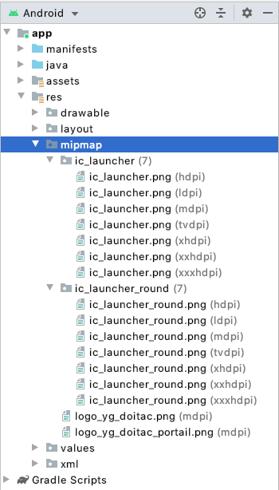

# YKit for Android

Video Tutorials: [file](files/How%20to%20integrate%20YKit%20to%20android.mp4) or [youtube](https://youtu.be/BQYVgPVMoV4)

Note: the image or video may be out of date

## Index
+ [A. Prerequisites](#a-prerequisites)
+ [B. Integrate SDK](#b-integrate-sdk)
    - [1. Add YKit library](#1-add-ykit-library)
    - [2. Config app](#2-config-app) 
    - [3. Implement code](#3-implement-code)
+ [C. Public function](#c-public-function)

## A. Prerequisites

+ [Android Studio 3.5.1 or higher](https://developer.android.com/studio/index.html)

+ Open Android Studio, click **File > Settings...**, choose **Appearance and Behavior > System Settings > Android SDK > SDK Tools**, install all packages in it


+ If the game uses NDK, open Android Studio, click **File > Project Structure**, set **JDK locations** and **Android NDK location**


## B. Integrate SDK

### 1. Add YKit library

+ Click **File > New > New Module**

    

+ Click **Import .JAR/.AAR Package** then click **Next**

    

+ Enter the location of **ykit-release.aar** file then click **Finish**

    

+ Add `libraries.gradle` to root project folder

    

+ Add this line end of file `gradle.properties`

    ```
    org.gradle.jvmargs=-Xmx2048m
    ```

    
+ Check the file settings.gradle. Please insert line below if it is not exist in the file
    ```
    include ':ykit-release'
    ```
+ Add "implementation deps.viewpump" to build.gradle
+ Update top-level `build.gradle` (`YKitDemo/proj.android-studio/build.gradle`)

```
    apply from: "./libraries.gradle"
    
    buildscript {
        repositories {
            google()
            jcenter()
            maven { url 'https://maven.fabric.io/public' }
            maven { url "https://plugins.gradle.org/m2/" }
        }
        dependencies {
            classpath 'com.android.tools.build:gradle:3.5.1'
            classpath 'com.google.gms:google-services:4.3.2'
            classpath 'io.fabric.tools:gradle:1.+'
            classpath 'com.jakewharton:butterknife-gradle-plugin:10.2.0'
            classpath 'com.jakewharton.hugo:hugo-plugin:1.2.1'
        }
    }
    
    allprojects {
        repositories {
            google()
            jcenter()
            maven { url "https://www.jitpack.io" }
        }
    }
    
    task clean(type: Delete) {
        delete rootProject.buildDir
    }
```


+ Update module-level `build.gradle` (`YKitDemo/proj.android-studio/app/build.gradle`)

    ```
    [...]
    apply plugin: 'io.fabric'
    
    android {
        compileSdkVersion rootProject.ext.compileSdkVersion
        buildToolsVersion rootProject.ext.buildToolsVersion
        
        defaultConfig {
            [...]
            minSdkVersion rootProject.ext.minSdkVersion
            targetSdkVersion rootProject.ext.targetSdkVersion
            multiDexEnabled true
        }
        
        compileOptions {
            sourceCompatibility rootProject.ext.sourceCompatibilityVersion
            targetCompatibility rootProject.ext.targetCompatibilityVersion
        }
        
        dexOptions {
            maxProcessCount 8
        }
    }
    
    repositories {
        mavenCentral()
        maven { url "https://jitpack.io" }
        maven { url 'https://maven.fabric.io/public' }
    }
    
    dependencies {
        [...]
        implementation project(path: ':ykit-release')
        
        implementation deps.supportDesign
        implementation deps.appcompat
        implementation deps.recyclerview
    
        implementation deps.multidex
    
        implementation deps.firebaseMessaging
        implementation deps.firebaseConfig
        implementation deps.firebaseAuth
        implementation deps.firebaseUIAuth
        implementation deps.firebaseAnalytics
          
        implementation deps.tagmanager
    
        implementation deps.playServicesAuth
        implementation deps.playServicesAds
        
        implementation deps.playServicesBase
        implementation deps.installReferrer
    
        implementation deps.billing
    
        implementation(deps.crashlytics) { transitive = true; }
        implementation(deps.answers) { transitive = true; }
    
        implementation deps.butterknife
        annotationProcessor deps.butterknifeCompiler
    
        implementation deps.dagger
        annotationProcessor deps.daggerCompiler
    
        implementation deps.androidannotations
        annotationProcessor deps.androidannotationsCompiler
    
        implementation deps.parceler
        annotationProcessor deps.parcelerCompiler
    
        implementation deps.retrofit
        implementation deps.retrofitConverterGson
        implementation deps.retrofitAdapterRxjava
    
        implementation deps.okhttp
        implementation deps.okhttpInterceptor
    
        implementation deps.gson
    
        implementation deps.transitionseverywhere
        implementation deps.calligraphy
    
        implementation deps.glide
        annotationProcessor deps.glideCompiler
    
        implementation deps.rxjava
        implementation deps.rxandroid
        implementation deps.rxlifecycle
        implementation deps.rxlifecycleAndroid
        implementation deps.rxlifecycleComponents
        implementation deps.nybus
        implementation deps.localeChanger
    
        implementation deps.dbflow
        implementation deps.dbflowCore
        implementation deps.dbflowRx2
    
        implementation deps.utilcode
    
        annotationProcessor deps.dbflowCompiler
        implementation deps.timber
    
        implementation deps.appsflyer
    
        implementation deps.facebook
    
        debugImplementation deps.leakcanary
        releaseImplementation deps.leakcanaryNoOp
        testImplementation deps.leakcanaryNoOp
    
        implementation deps.stetho
        implementation deps.stethoOkhttp3
        implementation deps.stethoUrlconnection
    
        implementation deps.traceur
    
        implementation deps.logger

        implementation deps.timeLineView
        implementation deps.outlineSpan
        implementation deps.linkBuilder
    
        implementation(deps.loggingInterceptor) {
            exclude group: 'org.json', module: 'json'
        }
    }
        
    apply plugin: 'com.google.gms.google-services'        
    ```
    


### 2. Config app 
+ Edit `AndroidManifest.xml`
+ First, insert two intent filters after main intent filter
```
            <intent-filter android:label="@string/app_name">
                <action android:name="android.intent.action.VIEW" />
                <category android:name="android.intent.category.DEFAULT" />
                <category android:name="android.intent.category.BROWSABLE" />
                <!-- Accepts URIs that begin with "http://test.ygame.vn/test” -->
                <data android:scheme="http"
                    android:host="AAAAA"
                    android:pathPrefix="AAAAA" />
                <!-- note that the leading "/" is required for pathPrefix-->
            </intent-filter>
            <intent-filter android:label="@string/app_name">
                <action android:name="android.intent.action.VIEW" />
                <category android:name="android.intent.category.DEFAULT" />
                <category android:name="android.intent.category.BROWSABLE" />
                <!-- Accepts URIs that begin with "example://gizmos” -->
                <data android:scheme="AAAAA"
                    android:host="AAAAA" />
            </intent-filter>
```
Replace `AAAAA` string with `App_Scheme` in file `config.xml`
+ Add this line to your activities

```
android:configChanges="keyboard|keyboardHidden|screenLayout|screenSize|orientation|locale|uiMode"
```

 
+ Add the following to `Application` tag
 
    ```    
    <provider
        android:name="com.facebook.FacebookContentProvider"
        android:authorities="com.facebook.app.FacebookContentProviderBBBBB"
        android:exported="true" />

    <meta-data
        android:name="com.facebook.sdk.ApplicationId"
        tools:replace="android:value"
        android:value="@string/facebook_app_id" />

    <meta-data
            android:name="com.google.android.gms.ads.APPLICATION_ID"
            android:value="CCCCC"/>
    ```
  
Replace `BBBBB` string with `FacebookAppID` in file `config.xml`

Replace `CCCCC` string with `Ads_Id` in file `config.xml` 
  
 + Add `facebook_app_id` to `app/res/values/strings.xml`
 
 
   
 + Add `config.xml` to `app/res/xml/` and `google-services.json` to `app/` (create the `app/res/xml/` directory if it's not exist)
 
   

 + Update all images "ic_launcher..." in mipmap with icon of YGame ( support for push notification )
 
 
 
### 3. Implement code

  + In your main activity class, init the YKit by add the following to `AppActivity.java`
  
  ```  
    public class AppActivity extends Cocos2dxActivity {
    
        @Override
        protected void onCreate(Bundle savedInstanceState) {
            [...]
    
            YKit.get().setServerTest(true); // true if server test, false if server real
            YKit.get().init(this, new YKitListener() {
                @Override
                public void onLogin(int userId, String accessToken) {
                    
                }
    
                @Override
                public void onLogout() {
                    
                }
    
                @Override
                public void onInAppPurchase(BillDto billDto) {
                }
    
                @Override
                public void onPause() {
                }
    
                @Override
                public void onResume() {
                }
            });
        }
    
        @Override
        protected void onResume() {
            super.onResume();
            YKit.get().onResume(this);
        }
    
        @Override
        protected void onPause() {
            super.onPause();
            YKit.get().onPause(this);
        }
    
        @Override
        protected void onDestroy() {
            super.onDestroy();
            YKit.get().onDestroy(this);
        }
    
        @Override
        protected void onActivityResult(int requestCode, int resultCode, Intent data) {
            YKit.get().onActivityResult(requestCode, resultCode, data, this);
        }

        YKit.get().setRemindContent("DDDDD");
    }
  ```   
  
  In the previous code, we provide some callback functions: 
  + `onLogin`: notify when user login to YKit system successfully. Handle this function and call login with your server
  + `onLogout`: the event will be fired when user sign out of YKit system. In this case, you must kick the user out of your server as well
  + `onInAppPurchase`: notify purchase success
  + `onPause`: call when game pause
  + `onResume`: call when game resume
  + `setRemindContent`: set remnind content for user ( please ask value of `DDDDD` from YGame )

## C. Setup YCoin Support

We provide a buy function, which used to buy the item from your game.

Buy function has 4 parameters:

+ serverId: current server id

+ charId: current character id

+ paymentId: The package user want to buy

+ isConfirm: If this is true, there will be a confirm diablog before user can buy. If false, user will instantly buy the item.

+ serverName: current server name

+ charName: current character name

```
public void buy(String serverId, String charId, String paymentId, boolean isConfirm, String serverName, String charName)
```

Example usage
```
YKit.get().buy("myServerId", "myCharId", "myPaymentId",false, "Server Name", "Character Name");
```

## D. Public function

  + `YKit.get().openLogin()`: open login windows 
  + `YKit.get().openInApp()`: open inapp purchase windows 
  + `YKit.get().openAccount()`: open account info windows 
  + `YKit.get().openNotification()`: open notification windows 
  + `YKit.get().logout()`: logout of YKit 
  + `YKit.get().showLauncher()`: show floating widget 
  + `YKit.get().hideLauncher()`: hide floating widget
  + `YKit.get().setServerTest(boolean isTest);`: Use server test or not
  + `YKit.get().setRemindContent(String reminderText);`: Reminder text if user don't play game for a long time
