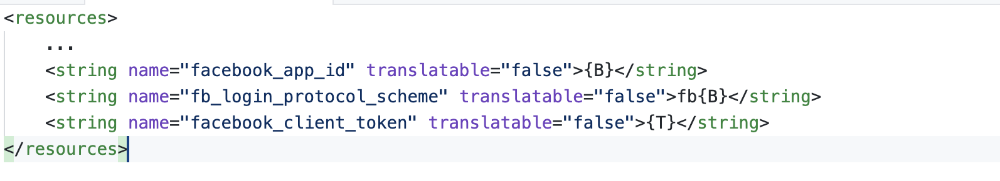

# YKit for Android

## 1 - Add YKit library

+ Click **File > New > New Module**

    

+ Click **Import .JAR/.AAR Package** then click **Next**

    

+ Enter the location of **ykit-release.aar"** file then click **Finish**

    

+ Add the following to `app/build.gradle`
    ```
    android {
        defaultConfig {
            [...]
            minSdkVersion 16
    }
    dependencies {
        [...]
        compile project(':ykit-release')
    }        
    ```
  
## 2 - Config app 
 
+ Open `AndroidManifest.xml`, add the following to `Application` tag
 
    ```
    <activity android:name="com.facebook.FacebookActivity"
                android:configChanges="keyboard|keyboardHidden|screenLayout|screenSize|orientation"
                android:label="@string/app_name" />
    
    <provider
        android:name="com.facebook.FacebookContentProvider"
        android:authorities="com.facebook.app.FacebookContentProviderXXXXXXXXXX"
        android:exported="true" />
    
    <meta-data
        android:name="com.facebook.sdk.ApplicationId"
        android:value="@string/facebook_app_id" />
    ```
  
 Replace `XXXXXXXXXX` string in `com.facebook.app.FacebookContentProviderXXXXXXXXXX` with your `facebook id` (you can get the `facebook id` in file `config.xml`)
           
       
   
 + Define value `facebook_app_id` in `app/res/values/strings.xml`
 
  
   
 + Add `config.xml` to `app/res/xml/` and `google-services.json` to `app/` (create the `app/res/xml/` directory if it's not exist)
 
   
 
## 3 - Implement code

  + In your main activity class, init the YKit by add the following to `AppActivity.java`
  
  ```  
    public class AppActivity extends Cocos2dxActivity {
    
        @Override
        protected void onCreate(Bundle savedInstanceState) {
            [...]
    
            YKit.init(this);
            YKit.setLauncherListener(new YKit.LauncherListener() {
                @Override
                public void onLogin(int userId, String accessToken) {
    
                }
    
                @Override
                public void onLoginAuto(int userId, String accessToken) {
    
                }
    
                @Override
                public void onLogout() {
    
                }
    
                @Override
                public void onInAppPurchase(InAppDto inAppDto) {
    
                }
    
                @Override
                public void onPause() {
    
                }
    
                @Override
                public void onResume() {
    
                }
            });
        }
    
        @Override
        protected void onResume() {
            super.onResume();
            YKit.onResume(this);
        }
    
        @Override
        protected void onPause() {
            super.onPause();
            YKit.onPause(this);
        }
    
        @Override
        protected void onActivityResult(int requestCode, int resultCode, Intent data) {
            YKit.onActivityResult(requestCode, resultCode, data, this);
        }
    }
  ```
  
  In the previous code, we provide some callback functions: 
  + `onLogin`, `onLoginAuto`: notify when user login to YKit system successfully. Handle this function and call login with your server
  + `onLogout`: the event will be fired when user sign out of YKit system. In this case, you must kick the user out of your server as well
  + `onInAppPurchase`: notify purchase success
  + `onPause`: call when game pause
  + `onResume`: call when game resume