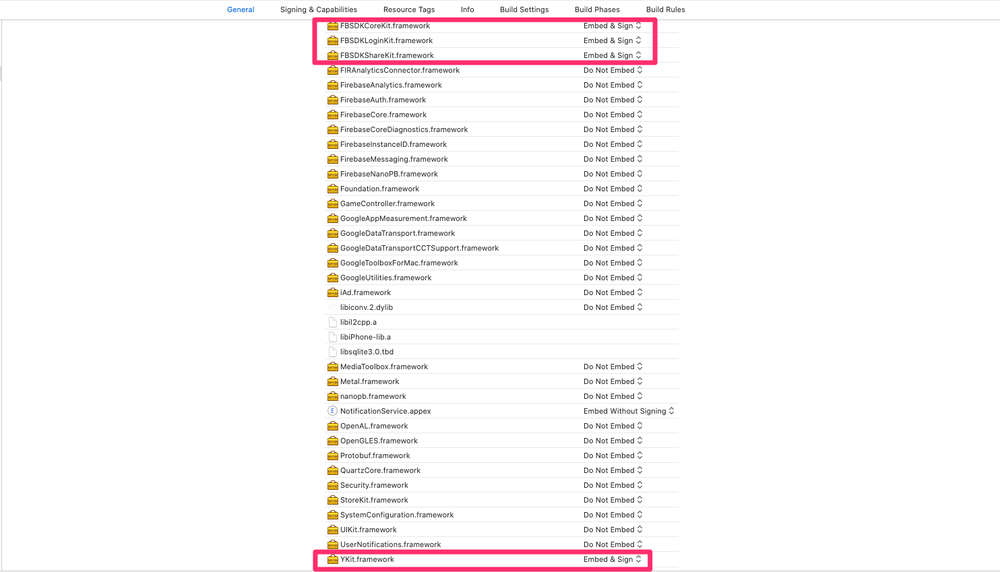
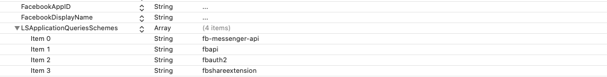
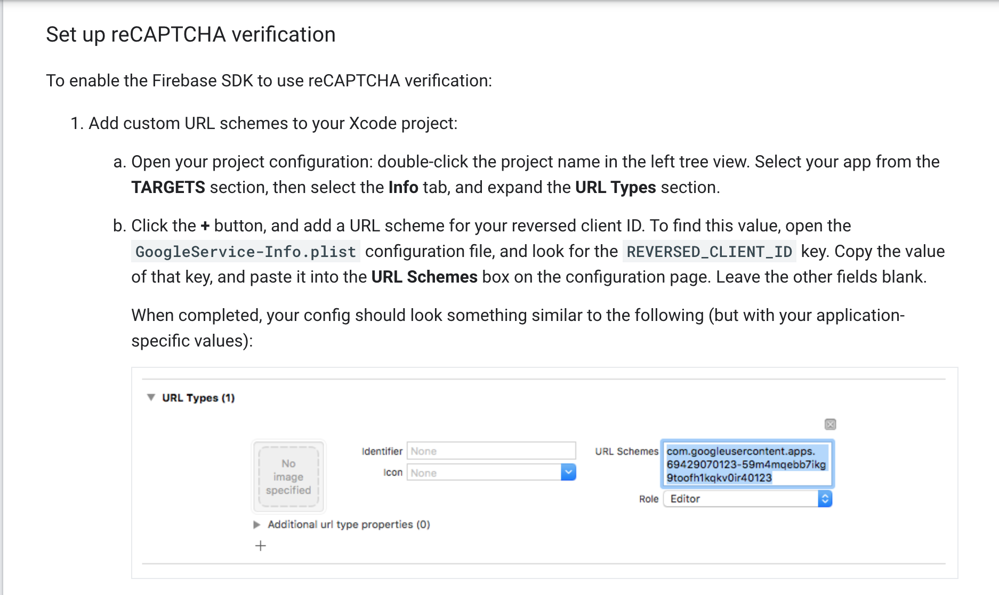
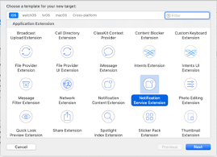
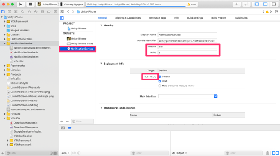
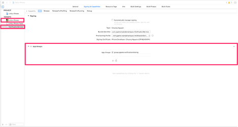
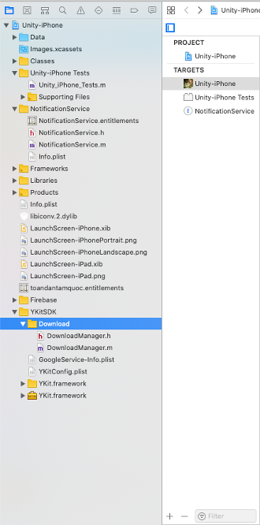
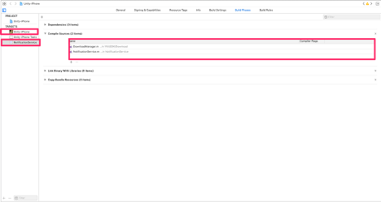
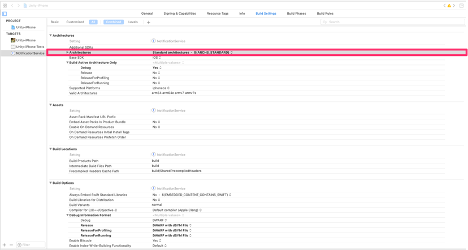

# YKitIOS for Native

## Get Started

YKit SDK for iOS is the most simple way to intergrate user and payment to YGame system. YKit SDK provide solution for payment such as: SMS, card, internet banking và Apple Payment.

## Steps to integrate SDK

    1. Setup YKit SDK
    2. Config SDK - Payment function
    3. YKit SDK flow

## Note
   - Make sure our project's deployment target is 8.0 at least.

### 1. Setup YKit SDK 
#### 1.1. Import YKit and Facebook frameworks into project

   - Drag and drop YKit.framework and framewords of Facebook into your project
   - Tick on checkbox: “Copy items into destination group's folder (if needed)”.
   - Add YKit.framework, FBSDKCoreKit.framework, FBSDKLoginKit.framework, FBSDKShareKit.framework to Frameworks, Libraries, and Embedded Content


#### 1.2. Add url schemes


  - xxxxx: bundle id of game
  - yyyyy: GoogleSignIn_ReverseClientID in YKitConfig.plist
  - bbbbb: FacebookUrlSchemes in YKitConfig.plist
  - mmmmm: AdsKey in YKitConfig.plist

  - In file info.plist of your project, add FacebookAppID, FacebookDisplayName and LSApplicationQueriesSchemes as below. You can get value of FacebookAppID and FacebookDisplayName in the YKitConfig.plist
   


   - Add file YKitConfig.plist to your root project

#### 1.3. Use SDK to login
##### 1.3.1 Config SDK setting
- Import SDK : ```#import <YKit/YKit.h>``` in AppController.m

- Add these lines of code in Application didFinishLaunchingWithOptions function in AppController class, after window setup. You can get GoogleSignIn_ClientID in the YKitConfig.plist.

```
- (BOOL)application:(UIApplication *)application didFinishLaunchingWithOptions:(NSDictionary *)launchOptions {
    // Project config
    
    // Start YKIT CONFIG
    YKit *launcher = [YKit getInstance];
        
    launcher.isPotrait = NO;
    
    // Handle login callback
    [launcher handleLoginWithCompletion:^(NSDictionary *data) {
         [launcher getFacebookInfo];
         NSString *userID = data[kParamUserID];
         NSString *userName = data[kParamUserName];
         NSString *accessToken = data[kParamAccessToken];
         //  NSLog(@"sample %@" ,[launcher getFacebookInfo]);
         [launcher showButtonLauncherWithAnimation:YES];
    }];
        
    // Handle logout callback
    [launcher handleLogoutWithCompletion:^{
            //do something
    }];
    
    // handle payment callback
    [launcher handlePaymentWithCompletion:^(NSDictionary *data){
         NSLog(@"Payment success! %@", data);
    }];
        
    //    NSLog(@"sample %@" ,[launcher getFacebookInfo]);
    [launcher setServerTest:NO];
   
    if ([launcher silentLogin]) {
            
    }
    // Example usage of silentLogin. For more information, check the public functions section.
    
    
    [launcher handleShowSDKCompletion:^{
        NSLog(@"I'm in YKit");
    }];
    
    NSString* appID = [[[NSBundle mainBundle] infoDictionary] objectForKey:@"CFBundleIdentifier"];
    [launcher handleCloseSDKCompletion:^{
        NSLog(@"Closed");
    }];
        
    NSDictionary *dict = @{kParamApplication: ATNonNilObject(application),
                           kParamOptions: ATNonNilObject(launchOptions)};
    ATDispatchEvent(Event_AppDidFinishLaunching, dict);    


    // [START configure_firebase]
    [FIRApp configure];
    // [END configure_firebase]
    
    // [START set_messaging_delegate]
    [FIRMessaging messaging].delegate = (id)self;
    // [END set_messaging_delegate]
    
    
    
    
    if (floor(NSFoundationVersionNumber) <= NSFoundationVersionNumber_iOS_7_1) {
        // iOS 7.1 or earlier. Disable the deprecation warnings.
        #pragma clang diagnostic push
        #pragma clang diagnostic ignored "-Wdeprecated-declarations"
        UIRemoteNotificationType allNotificationTypes =
        (UIRemoteNotificationTypeSound |
         UIRemoteNotificationTypeAlert |
         UIRemoteNotificationTypeBadge);
        [application registerForRemoteNotificationTypes:allNotificationTypes];
        #pragma clang diagnostic pop
    } 
    else {
        // iOS 8 or later
        // [START register_for_notifications]
        if (floor(NSFoundationVersionNumber) <= NSFoundationVersionNumber_iOS_9_x_Max) {
            UIUserNotificationType allNotificationTypes =
            (UIUserNotificationTypeSound | UIUserNotificationTypeAlert | UIUserNotificationTypeBadge);
            UIUserNotificationSettings *settings =
            [UIUserNotificationSettings settingsForTypes:allNotificationTypes categories:nil];
            [[UIApplication sharedApplication] registerUserNotificationSettings:settings];
        } else {
            // iOS 10 or later
            #if defined(__IPHONE_10_0) && __IPHONE_OS_VERSION_MAX_ALLOWED >= __IPHONE_10_0
            // For iOS 10 display notification (sent via APNS)
            [UNUserNotificationCenter currentNotificationCenter].delegate = self;
            UNAuthorizationOptions authOptions =
            UNAuthorizationOptionAlert
            | UNAuthorizationOptionSound
            | UNAuthorizationOptionBadge;
            [[UNUserNotificationCenter currentNotificationCenter] requestAuthorizationWithOptions:authOptions completionHandler:^(BOOL granted, NSError * _Nullable error) {
            }];
      #endif
        }
        
        [[UIApplication sharedApplication] registerForRemoteNotifications];
        // [END register_for_notifications]
    }
    
    [launcher setReminderLogin:@"xxxxxxxxxxxxxxxxxx" after:3];
    
    if (@available(iOS 13.0, *)) {
       [_window setOverrideUserInterfaceStyle:UIUserInterfaceStyleLight];
    } else {
       // Fallback on earlier versions
    }


    // END YKIT CONFIG
    
    return YES;
}

- xxxxxxxxxxxxxxxxxx: notification for user, it is provided by YGame ( please contact with YGame )

```
- In the previous code, we provide two callback functions. There are handleLoginWithCompletion and handleLogoutWithCompletion. You may use these functions to call login or logout with your server
            
- Add function handle Facebook schemes 

```
- (BOOL)application:(UIApplication *)application openURL:(NSURL *)url sourceApplication:(NSString *)
            sourceApplication annotation:(id)annotation { 

            NSDictionary *dict = @{kParamApplication: ATNonNilObject(application), kParamUrl: ATNonNilObject(url), 
            kParamSourceApplication: ATNonNilObject(sourceApplication), kParamAnnotation: ATNonNilObject(annotation)}; 

            ATDispatchEvent(Event_AppOpenUrl, dict); 

            return YES; 
}
- (BOOL)application:(UIApplication *)app openURL:(NSURL *)url options:(NSDictionary<UIApplicationOpenURLOptionsKey,id> *)options
{
    
    NSDictionary *dict = @{kParamApplication: ATNonNilObject(app),
                           kParamUrl: ATNonNilObject(url),
                           kParamOptions: ATNonNilObject(options)};
    ATDispatchEvent(Event_AppOpenUrlEx, dict);
    
    
    return YES;
}
```
##### 1.3.2 Show login view

Step 1: Must register view controller which presenting YKit login view
 param:
     -rootViewController: the view controller will show SDK
     -usingFacebookSDK: use FB to login // default NO
```
- (void)viewDidload {
   [super viewDidload];
   YKit *launcher = [YKit getInstance];
   [launcher willShowInRootViewController:self usingFacebookSDK:YES];
}

```
Step 2: Show loginView 
```
- (IBAction)onLoginButtonAction:(id)sender
{
   YKit *launcher = [YKit getInstance];
   [launcher showLoginScreen];
}
```


#### 1.4. Setup Firebase Push-Notifications
##### 1.4.1 Setup Firebase framework

- Drap and drop frameworks of Firebase into your project. (Remember to target your project)


- Drap & drop GoogleService-Info.plist into your game (Remember to target your project)


- Add the -ObjC linker flag in your Other Linker Settings in your target's build settings.


- Add firebase.h next to your appcontroller (Remember to target your project)


- In Linked Frameworkds and Libraries. Click the + Icon down below and add there 3 frameworks: 
    - libsqlite3.0.tbd
    - GameController.framework
    - UserNotifications.framework

 

 


##### 1.4.2 Setup firebase code

- In your appcontroller.h, ```#import "Firebase.h"``` and add FIRMessagingDelegate to the interface like picture below

- Add these pre-defined macros for firebase above Implementation

```
// Implement UNUserNotificationCenterDelegate to receive display notification via APNS for devices
// running iOS 10 and above.
#if defined(__IPHONE_10_0) && __IPHONE_OS_VERSION_MAX_ALLOWED >= __IPHONE_10_0
#import <UserNotifications/UserNotifications.h>
@interface AppController () <UNUserNotificationCenterDelegate>
@end
#endif

// Copied from Apple's header in case it is missing in some cases (e.g. pre-Xcode 8 builds).
#ifndef NSFoundationVersionNumber_iOS_9_x_Max
#define NSFoundationVersionNumber_iOS_9_x_Max 1299
#endif

#define SYSTEM_VERSION_GRATERTHAN_OR_EQUALTO(v)  ([[[UIDevice currentDevice] systemVersion] compare:v options:NSNumericSearch] != NSOrderedAscending)
```

- Start firebase: Add these code to didFinishLaunchingWithOptions in your appcontroller.m after ykit setup

```
    // [START configure_firebase]
    [FIRApp configure];
    // [END configure_firebase]
    
    // [START set_messaging_delegate]
    [FIRMessaging messaging].delegate = self;
    // [END set_messaging_delegate]
```

- Setup to receive push notifications: Add these code to didFinishLaunchingWithOptions in your appcontroller.m after firebase configure

```
if (floor(NSFoundationVersionNumber) <= NSFoundationVersionNumber_iOS_7_1) {
        // iOS 7.1 or earlier. Disable the deprecation warnings.
#pragma clang diagnostic push
#pragma clang diagnostic ignored "-Wdeprecated-declarations"
        UIRemoteNotificationType allNotificationTypes =
        (UIRemoteNotificationTypeSound |
         UIRemoteNotificationTypeAlert |
         UIRemoteNotificationTypeBadge);
        [application registerForRemoteNotificationTypes:allNotificationTypes];
#pragma clang diagnostic pop
    } else {
        // iOS 8 or later
        // [START register_for_notifications]
        if (floor(NSFoundationVersionNumber) <= NSFoundationVersionNumber_iOS_9_x_Max) {
            UIUserNotificationType allNotificationTypes =
            (UIUserNotificationTypeSound | UIUserNotificationTypeAlert | UIUserNotificationTypeBadge);
            UIUserNotificationSettings *settings =
            [UIUserNotificationSettings settingsForTypes:allNotificationTypes categories:nil];
            [[UIApplication sharedApplication] registerUserNotificationSettings:settings];
        } else {
            // iOS 10 or later
#if defined(__IPHONE_10_0) && __IPHONE_OS_VERSION_MAX_ALLOWED >= __IPHONE_10_0
            // For iOS 10 display notification (sent via APNS)
            [UNUserNotificationCenter currentNotificationCenter].delegate = self;
            UNAuthorizationOptions authOptions =
            UNAuthorizationOptionAlert
            | UNAuthorizationOptionSound
            | UNAuthorizationOptionBadge;
            [[UNUserNotificationCenter currentNotificationCenter] requestAuthorizationWithOptions:authOptions completionHandler:^(BOOL granted, NSError * _Nullable error) {
            }];
#endif
        }
        
        [[UIApplication sharedApplication] registerForRemoteNotifications];
        // [END register_for_notifications]
    }
```
 - Setup handling message: Add these functions to your appcontroller.m

```
// [START receive_message]
- (void)application:(UIApplication *)application didReceiveRemoteNotification:(NSDictionary *)userInfo {
    
}

- (void)application:(UIApplication *)application didReceiveRemoteNotification:(NSDictionary *)userInfo
fetchCompletionHandler:(void (^)(UIBackgroundFetchResult))completionHandler {
   
    completionHandler(UIBackgroundFetchResultNewData);
}
// [END receive_message]

// [START ios_10_message_handling]
// Receive displayed notifications for iOS 10 devices.
#if defined(__IPHONE_10_0) && __IPHONE_OS_VERSION_MAX_ALLOWED >= __IPHONE_10_0
// Handle incoming notification messages while app is in the foreground.
- (void)userNotificationCenter:(UNUserNotificationCenter *)center
       willPresentNotification:(UNNotification *)notification
         withCompletionHandler:(void (^)(UNNotificationPresentationOptions))completionHandler {
    NSDictionary *userInfo = notification.request.content.userInfo;
    //[[YKit getInstance] appDidReceiveMessage:userInfo];
    // Change this to your preferred presentation option
    completionHandler(UNNotificationPresentationOptionAlert); 
}

// Handle notification messages after display notification is tapped by the user.
- (void)userNotificationCenter:(UNUserNotificationCenter *)center
didReceiveNotificationResponse:(UNNotificationResponse *)response
         withCompletionHandler:(void(^)())completionHandler {
    NSDictionary *userInfo = response.notification.request.content.userInfo;
    
    completionHandler();
}
#endif
// [END ios_10_message_handling]

// [START refresh_token]
- (void)messaging:(nonnull FIRMessaging *)messaging didRefreshRegistrationToken:(nonnull NSString *)fcmToken {
    [[YKit getInstance] setFCMToken:fcmToken];
}
// [END refresh_token]

// [START ios_10_data_message]

- (void)messaging:(FIRMessaging *)messaging didReceiveMessage:(FIRMessagingRemoteMessage *)remoteMessage {
    [[YKit getInstance] appDidReceiveMessage:remoteMessage.appData];
}
// [END ios_10_data_message]

- (void)application:(UIApplication *)application didFailToRegisterForRemoteNotificationsWithError:(NSError *)error {
    NSLog(@"Unable to register for remote notifications: %@", error);
}

- (void)application:(UIApplication *)application didRegisterForRemoteNotificationsWithDeviceToken:(NSData *)deviceToken {
    NSString *fcmToken = [FIRMessaging messaging].FCMToken;
    [[YKit getInstance] setFCMToken:fcmToken];
}
```


##### 1.4.3 Setup firebase for authentication (verify OTP)
- Before setup firebase for authentication please ensure that you followed steps in 1.4.1 Setup Firebase framework
Fist of all, you need to config URL type in your target following below instruction image or following this link: https://firebase.google.com/docs/auth/ios/phone-auth



- In your appcontroller.m, add YKitDelegate to listen request authentication code like code below:
```
@interface AppController () <UNUserNotificationCenterDelegate, YKitDelegate>
```
- In ```- (BOOL)application:(UIApplication *)application didFinishLaunchingWithOptions:(NSDictionary *)launchOptions``` method add delegate config to receive events:
```
 YKit *launcher = [YKit getInstance];
 launcher.delegate = self;
```
- Add 2 method and call to FIRPhoneAuthProvider to verify

```
// Firebase FIRPhoneAuthProvider sms verify

-(void)requestSendOTPWithPhone:(NSString *)phoneNumber completion:(void (^)(NSString *, NSError *))callback {
    [[FIRPhoneAuthProvider provider] verifyPhoneNumber:phoneNumber
                                            UIDelegate:nil
                                            completion:^(NSString * _Nullable verificationID, NSError * _Nullable error) {
                                                if (callback) {
                                                    callback(verificationID,error);
                                                }
                                                return;
                                            }];
}

- (void)verifyPhoneNumberWithOTPcode:(NSString *)code andVerificationID:(NSString *)verificationID completion:(void (^)(NSString *phone, NSError *error))callback {
    FIRAuthCredential *credential = [[FIRPhoneAuthProvider provider]
                                     credentialWithVerificationID:verificationID
                                     verificationCode:code];
    [[FIRAuth auth] signInWithCredential:credential
                              completion:^(FIRAuthDataResult * _Nullable authResult,
                                           NSError * _Nullable error) {
                                  if (error) {
                                      callback(@"",error);
                                      return;
                                  }
                                  
                                  if (authResult == nil) {
                                      callback(@"",nil);
                                      return;
                                  }
                                  
                                  FIRUser *user = authResult.user;
                                  callback(user.uid, nil);
                              }];
}

```

#### 1.5. Setup NotificationService
- Add extension Notification Service Extension  in Target with name NotificationService



- Replace file NotificationService.m with file NotificationService.m in directory "NotificationService" of YGame
- Set Version, Build are same as your project
- Set Target 10.0



- Add App Groups in Signing & Capabilities for your project and NotificationService

- Add directory "Download" of YGame to your project

- Add file DownloadManager.m into Compile Source in Build Phases ( both your project and NotificationService )

- Set Architectures = Standard in NotificationService


#### 1.6. Setup local push reminder to play the game
```
//SETUP 3 DAY LATER NOTIFICATION IF USER HAVEN'T PLAYED
    [launcher setReminderLogin:@"xxxxxxxxxxxxxxxx" after:3];
```    

#### 1.6. Public functions
Here is the list of public functions you can call to customize the YKit in your game: 

* setLauncherStickySide: You can specific the side that launcher can stick to via the or bitwise. 
Ex: ATButtonStickySideTop | ATButtonStickySideBottom 
* setServerTest: Use ygame server test
* silentLogin: When open the app, maybe user is already logged in. Call this function to check if user is logged in or not, if not, you must call showLoginScreen function to show the login screen. 

```
if([[YKit getInstance] silentLogin])
	// Move direct to game
else {
	// Show login screen
	[[YKit getInstance] showLoginScreen];
}
```

* showButtonLauncherWithAnimation: Show SDK hovering button. (set YES to enable fading animation and NO to instantly show)
* hideButtonLauncherWithAnimation: Hide SDK hovering button. (set YES to enable fading animation and NO to instantly hide)

```
[launcher showButtonLauncherWithAnimation:YES];
[launcher hideButtonLauncherWithAnimation:YES];
```

* showLoginScreen: Show the login screen, if user not logged in yet
* showPaymentScreen: You may want to show payment screen from your game
* handleShowSDKCompletion: You can get the event show SDK here
* handleCloseSDKCompletion: You can get the event show SDK here

#### 1.7. Turn on Application necessary Capabilities.

- Turn on Push Notification
- Turn on InApp-Purchase
- Turn on Sign In With Apple

### 2. Buy item in game by using YCoin
We provide a buy function, which used to buy the item from your game. You can buy with parameters:

+serverId: User current server id

+char_id: User current character id

+payment_id: The package user want to buy

+isConfirm: If this is true, there will be a confirm diablog before user can buy. If false, user will instantly buy the item.

+serverName: current server name

+charName: current character name

```
(BOOL)buy:(NSString*)serverId char_id:(NSString*)charId payment_id:(NSString*)payment isConfirm:(bool)is_confirm server_name:(NSString*)serverName char_name:(NSString*)charName;
```
Example usage

```
[ykit buy:@"Server ID" char_id:@"Character ID" payment_id:@"Payment package" isConfirm:YES server_name:@"Server Name" char_name:@"Char Name"];

```

### 3. Flow

#### 3.1. Login flow: 


#### 3.2. Payment flow:

